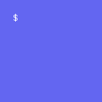

# Stock Ticker Dashboard — Chrome Extension

A fully standalone Chrome extension that gives you a live stock dashboard on every new tab. No backend required — data comes directly from Yahoo Finance.



## Features

- **Live ticker strip** — scrolling price bar with color-coded chips, $change and %change
- **Draggable widget grid** — resize and rearrange charts freely
- **Price history charts** — single stock or multi-stock combined, with period-direction color (green/red)
- **KPI card toggle** — flip any chart widget to show fundamentals (P/E, EPS, beta, 52w range, sector)
- **News feed widget** — latest headlines from Yahoo Finance RSS
- **Multiple tabs** — organize widgets into named dashboard tabs; copy/move widgets between tabs
- **Global period selector** — change all charts on the active tab in one click (1D → 5Y)
- **AI chat** — powered by Gemini API, can add widgets from natural language
- **Light / Dark theme** — toggle in the header
- **Auto-refresh** — configurable interval, manual refresh button refreshes all data at once
- **Watchlist management** — add/remove symbols via Settings

---

## Prerequisites

- [Node.js](https://nodejs.org/) v18 or later
- [npm](https://www.npmjs.com/) (comes with Node.js)
- Google Chrome (or any Chromium-based browser)

---

## Setup for Developers

### 1. Clone the repository

```bash
git clone https://github.com/navin1/stocks_ticker.git
cd stocks_ticker
```

### 2. Install dependencies

```bash
npm install
```

### 3. Build the extension

```bash
npm run build
```

This compiles TypeScript, bundles with Vite, and outputs the extension to the `dist/` folder.

### 4. Load the extension in Chrome

1. Open Chrome and go to `chrome://extensions`
2. Enable **Developer mode** (toggle in the top-right corner)
3. Click **Load unpacked**
4. Select the `dist/` folder inside the project directory
5. The extension is now installed — open a new tab to see the dashboard

### 5. Development mode (hot reload)

```bash
npm run dev
```

Opens a local dev server at `http://localhost:5173`. Useful for UI development, but Chrome storage and extension APIs won't be available — the app falls back gracefully.

---

## Rebuilding after code changes

Every time you change the source code, rebuild and reload:

```bash
npm run build
```

Then go to `chrome://extensions` and click the **↻ reload** button on the Stock Ticker card.

---

## Adding stocks to the default watchlist

**For existing installs** — click the ⚙ gear icon in the dashboard header → type a ticker in the Watchlist field → press Enter → Save.

**To change the code default** (applies to fresh installs only) — edit `src/App.tsx`:

```ts
const DEFAULT_SETTINGS: AppSettings = {
  symbols: ['AAPL', 'MSFT', 'GOOGL', 'AMZN', 'NVDA'],  // add more here
  ...
}
```

---

## KPI / Fundamentals data

The KPI card (toggle via the `⊞` button on any chart widget) fetches data using a three-stage strategy:

1. **Yahoo Finance v10/quoteSummary** with a session crumb — full data (P/E, EPS, beta, sector, dividend yield). Requires you to have visited [finance.yahoo.com](https://finance.yahoo.com) at least once so the browser has a session cookie.
2. **Yahoo Finance v7/finance/quote** — good fallback, no crumb needed.
3. **v8/chart 1-year candles** — always works; shows price, 52-week high/low computed from candle data.

If you only see 52w High/Low, open [finance.yahoo.com](https://finance.yahoo.com) in a tab and reload the extension.

---

## AI Chat (optional)

1. Get a free Gemini API key from [Google AI Studio](https://aistudio.google.com/app/apikey)
2. Click ⚙ Settings → paste the key into the **Gemini API Key** field → Save
3. Click **Chat** in the header to open the AI panel

---

## Project structure

```
src/
  api/          Yahoo Finance + Gemini API calls
  components/   UI components (TickerStrip, WidgetGrid, widgets, TabMenu…)
  hooks/        React Query hooks (useQuotes, useChart, useFundamentals…)
  types/        TypeScript types (Widget, Tab, Quote, Candle…)
  utils/        Color map, hex→rgba helpers
public/
  manifest.json Chrome extension manifest (MV3)
  background.js Service worker — opens dashboard on toolbar click
  icons/        Extension icons
dist/           Built extension — load this folder in Chrome
```

---

## Tech stack

| Layer | Library |
|---|---|
| UI | React 18 + TypeScript |
| Build | Vite |
| Styling | Tailwind CSS v3 |
| Charts | Recharts |
| Grid | react-grid-layout |
| Data fetching | TanStack Query v5 |
| AI | Google Gemini REST API |
| Data source | Yahoo Finance (unofficial API) |
